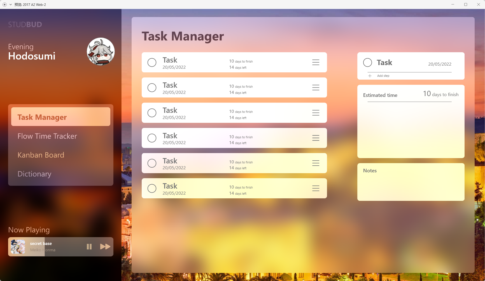
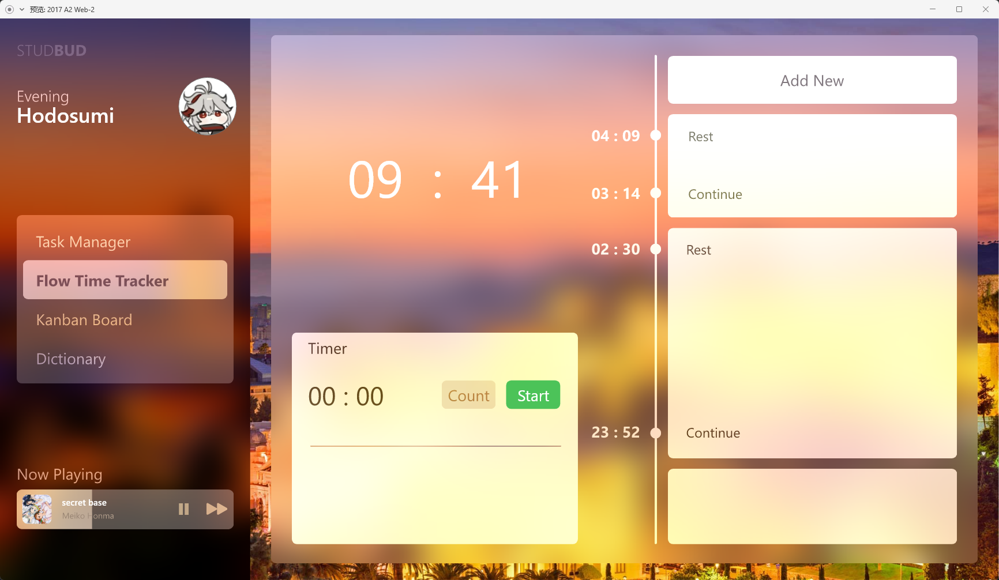
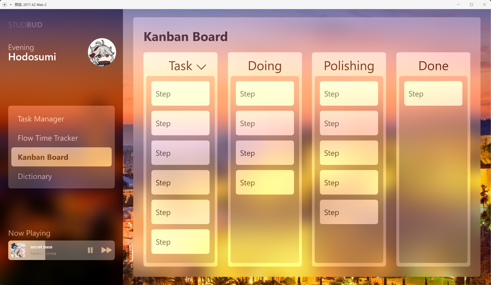
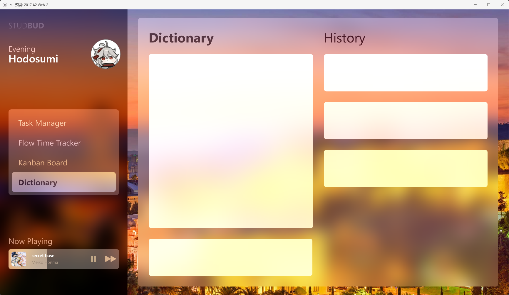
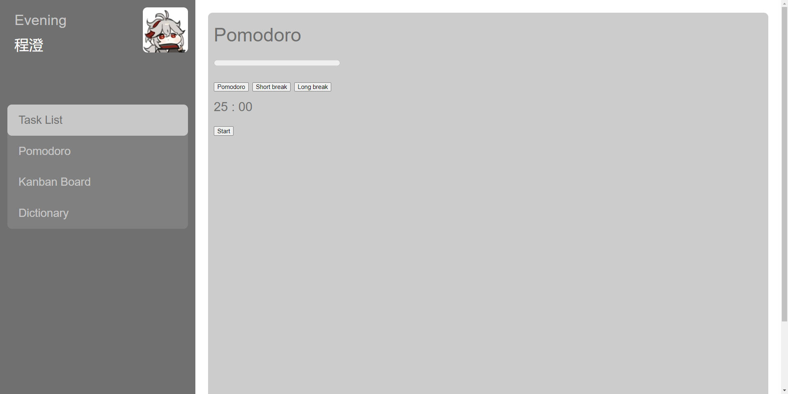

# DECO 2017 A3
##### **CTAN8981** 
##### Studbud

---

**Table of contents**

**1. [The original Design](#the-original-design)**

**2. [Problems Encountered](#problems-encountered)**

**3. [Development Roadmap](#development-roadmap)**

**4. [Reflection](#reflection)**

**5. [Reference Links](#reference-links)**

---

## The Original Design

The original design of studbud is like this:

>1. **Task Manager**
>

>2. **Flow Time Tracker**


>3. **Kanban Board**
>

>4. **Dictionary**
>

>5. **Music Player** at the left corner
>

---

## Problems Encountered

As I working through the assignment, I found that I cannot make javascript work at the place I wanted.

>1. I cannot apply the DOM changes
>1. The browser does not syncrinize everytime I made some changes
>1. The import function does not work and stop me from opening localhost
>1. I learnt from web and apply to my work but it does not work
>1. I lose confidence and patience during the work
>1. I did not learn well for this semester's JavaScript


* I found some tutorials on the web and planned to follow and make my own web app, but every time it just does not work, I've been working on one single problem for 4 days which is just a tab effect.

Here is the JS code and there are different versions in the [script.js](/public/script.js) file

```javascript

var tab = document.getElementsByClassName('tab')[0];
var tabCart = tab.getElementsByTagName('li');
var content = document.getElementsByClassName('main')[0];
var contentCart = content.getElementsByTagName('div');

tab.addEventListener('click',function(e){
    console.log(tabCart.length)
    var index = '1'
    for(var i=0;i<tabCart.length;i++){
        if(e.target==tabCart[i]){
            index = i
        }
    }
    tabCart[index].classList.add("active")
    for(var i=0;i<tabCart.length;i++){
        if(tabCart[i] != tabCart[index]){
            tabCart[i].classList.remove("active")
            console.log(1)
        }
    }
    contentCart[index].classList.add("contentShow")
    for(var i=0;i<contentCart.length;i++){
        if(contentCart[i] != contentCart[index]){
            contentCart[i].classList.remove("contentShow")
            
        }
    }
})

```

* Though I get the right class name and Id name, I still cannot make it change like I wished. I found many code solution and trie them for many times but I cannot get pass this

The website tutorial I found are listed below
>1. [Task list 1](https://freshman.tech/todo-list/)
>1. [Task list 2](https://thecodingpie.medium.com/how-to-build-a-todo-list-app-with-javascript-and-local-storage-a884f4ea3ec)
>1. [Kanban Borad](https://www.cssscript.com/draggable-kanban-board/)
>1. [Pomodoro](https://freshman.tech/pomodoro-timer/)
>1. [Dictionary API](https://www.youtube.com/watch?v=qWjEUO8C3LY)
>1. [Dictionary](https://www.makeuseof.com/build-dictionary-app-using-javascript/)
>1. [Tab](https://blog.csdn.net/qq_15096707/article/details/50605671)

I tried to follow the tutorial but failed
I kept trying, tried to at least finish one function, but I stucked at the tab function task list and pomodoro

---

## Development Roadmap

From the above section you may noticed, why would I studcked in doing pomodoro when my prototype design is flow time tracker

It is because I cannot figure out how to put the effect I want on the time flow. So I changed to Pomodoro as it sounds easier

### **Iteration**s of this unfinished work are listed below

>This is the **html version**
>
>This is the **XD prototype**
>

>1. User profile from **round** to **rounded rectangle**
>1. Canceled the **frosted glass testure**
>1. Side navigation style from **embedded highlighting active** to **equal-width highlighting**
>1. Changed the funciton **Flow Time Tracker** to **Pomodoro**

---

## Reflection

About this Assignment, this is a failed project

It is not finished due to the following reasons
>1. Did not catch up the lecture and learnt very little JS knowledge
>1. When failed to debug, I lost my patience and faith/confidence
>1. I did not arrange my time well
>1. I have a part-time job which took most of my time(though that could be an excuse)

To make up these mistakes I made, prevent similar things from happening again, I shall use my time from this break to do the following things
>1. Study DOM manipulation
>1. Restart the STUDBUD project and make it fits the prototype
>1. Learn the real time management
>1. Make DECO1016's static pages interactable by linking JavaScript files into it to practice the use of JS

---

## Reference Links

1. (2022). Retrieved 4 June 2022, from https://www.youtube.com/watch?v=qWjEUO8C3LY

1. Draggable Kanban Boards In Vanilla JavaScript - jKanban | CSS Script. (2022). Retrieved 4 June 2022, from https://www.cssscript.com/draggable-kanban-board/

1. How to Build a Todo List App With Javascript and Local Storage. (2022). Retrieved 4 June 2022, from https://thecodingpie.medium.com/how-to-build-a-todo-list-app-with-javascript-and-local-storage-a884f4ea3ec

1. Isaiah, A. (2022). How to build a Pomodoro Timer App with JavaScript. Retrieved 4 June 2022, from https://freshman.tech/pomodoro-timer/

1. Isaiah, A. (2022). How to build a Todo List App with JavaScript. Retrieved 4 June 2022, from https://freshman.tech/todo-list/

1. Learn To Build a Simple Dictionary Application Using JavaScript. (2022). Retrieved 4 June 2022, from https://www.makeuseof.com/build-dictionary-app-using-javascript/

1. 使用js实现tab选项卡效果_葡萄干是个程序员的博客-CSDN博客_js tab. (2022). Retrieved 4 June 2022, from https://blog.csdn.net/qq_15096707/article/details/50605671